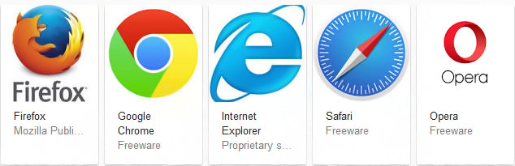
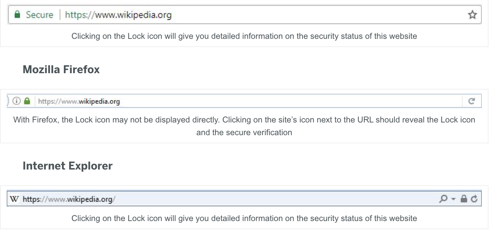
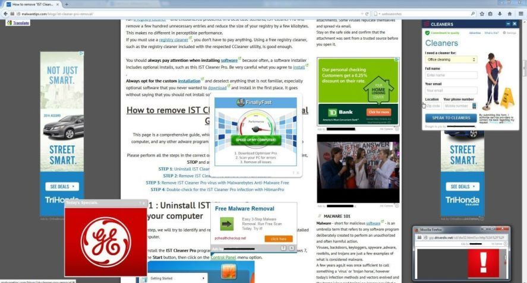

# *What is the internet?*
- As time goes on the internet is becoming a *very important* part of everyday life.
- The internet is a global network of billions of computers and electronic devices.
- We are able to connect, gather information on just about anything, and much more on the internet.
- With that being said it is easy to get confused on how to use the internet!
## How to use the internet
1. First things first is you will need to identify what web browser you want to use. That could be Google Chrome, Safari, Firefox and others.
2. 
3. Once you have found the web browser you will need to open whichever of your choosing!
4. Depending on which web browser you use, you will need to find the search bar which is more than likely at the top of the page, or if you are using google chrome it will be in the middle of the page.
5. After you have found the search bar you will need to click on it and then type in what you are trying to find!
6. Once you press "Enter" or "Return"(depending on what type of computer you have) a long list of links for websites that will provide the information you are looking for!
7. **Be very careful on what links you click on!! Always try and look for the website to start with "https" rather than "http"**
8. **Look for a lock icon and click on it to make sure the website you are on is safe!!**
9. 
10. **DO NOT CLICK ON ANY POP UP ADS ON A WEBPAGE THAT LOOK LIKE THIS!!**
11. 
12. **Have fun browsing while being safe and completing your needs on the internet!!**
-[Home](https://github.com/jcwnpd/Final-Project/blob/aee63e2a6d896432a0bab2ebb10946f2df3023b0/README.md)
